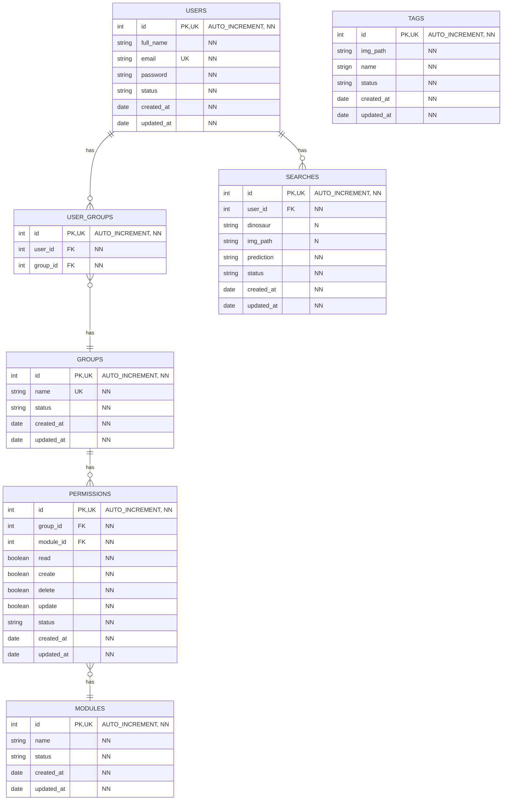

# Diagrama entidad-relación

```mermaid
    erDiagram

        USERS {
            int id PK, UK "AUTO_INCREMENT, NN"
            string full_name "NN"
            string email UK "NN"
            string password "NN"
            string status "NN"
            date created_at "NN"
            date updated_at "NN"
        }

        USER_GROUPS {
            int id PK, UK "AUTO_INCREMENT, NN"
            int user_id FK "NN"
            int group_id FK "NN"
        }

        GROUPS {
            int id PK, UK "AUTO_INCREMENT, NN"
            string name UK "NN"
            string status "NN"
            date created_at "NN"
            date updated_at "NN"
        }

        PERMISSIONS {
            int id PK, UK "AUTO_INCREMENT, NN"
            int group_id FK "NN"
            int module_id FK "NN"
            boolean read "NN"
            boolean create "NN"
            boolean delete "NN"
            boolean update "NN"
            string status "NN"
            date created_at "NN"
            date updated_at "NN"
        }

        MODULES {
            int id PK, UK "AUTO_INCREMENT, NN"
            string name "NN"
            string status "NN"
            date created_at "NN"
            date updated_at "NN"
        }

        TAGS {
            int id PK, UK "AUTO_INCREMENT, NN"
            string img_path "NN"
            strign name "NN"
            string status "NN"
            date created_at "NN"
            date updated_at "NN"
        }

        SEARCHES {
            int id PK, UK "AUTO_INCREMENT, NN"
            int user_id FK "NN"
            string dinosaur "N"
            string img_path "N"
            string prediction "NN"
            string status "NN"
            date created_at "NN"
            date updated_at "NN"
        }

        USERS ||--o{ USER_GROUPS : has
        USER_GROUPS }o --|| GROUPS : has
        GROUPS ||--o{ PERMISSIONS : has
        PERMISSIONS }o--|| MODULES : has
        USERS ||--o{ SEARCHES : has
```
